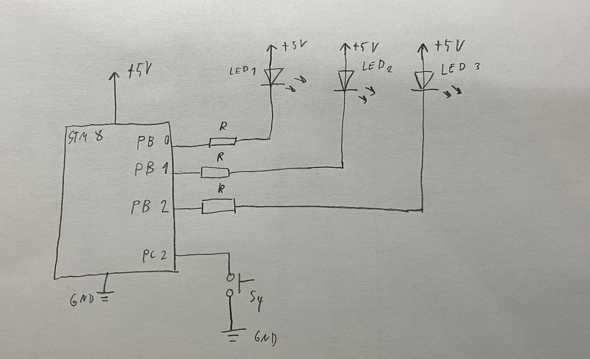

Timer_blika_led_tlacitko_meni_led project
===========================

Účel/Zadání/Funkce
-----------------------

Pomocí přerušení 16b TIMERu (TIM2, TIM3) nastavte půlperiodu blikání LED diody na přesně 400 ms.
Pomocí tlačítka (reaguje na hranu) přepínejte mezi třemi různými LED. Tedy: tlačítko vybírá, která LED bliká.
Zajistěte, že po přepnutí na další LED, předchozí LED zhasne. Rovněž zajistěte, že blikání bude plynulé -- tedy že rozsvícení a zhasnutí LED proběhne vždy ne při stisku tlačítka, ale v pevném časovém rámci, který je dán půlperiodou 400 ms.

Např.: Bliká LED6. Stisknu tlačítko, bliká LED5. Stisknu tlačítko, bliká LED4. Stisknu tlačítko, bliká LED6. atd. Frekvence blikání je stále stejná a je dána půlperiodou 400 ms (perioda 800 ms).

Schéma zapojení
-----------------------

Popis funkce
-----------------------

1. Nastavím TIMER na 400 ms a povolím přerušení, kde se vykonává program
2. V rutině přerušení jsou 3 IFy, kde každý IF určuje jaká LED má právě blikat
3. Přepínání LED dělám pomocí proměnné led_pointer1, její hodnota se mění při stisku tlačítka S4, tlačítko reaguje při náběžné hraně 

Zhodnocení
-----------------------
Projekt jsem zvádnul bez potíží, zjistil jsem, že na mé desce je pravděpodobně chyba a to prohozené piny pro tlačítka S1 a S2 ( když chci pracovat s S1, tak S1 nereaguje a S2 reaguje  a naopak). Tak jsem to vyřešil tak, že jsem v hlavičkovém souboru sonboardu prohodil jen čísla pinů na nucleo a už to funguje jak má. Na tomto projektu jsem si vyzkoušel jak funguje timer a jak funguje vyrobená deska z praxí Sonboard. Svou práci hodnotím za 1.

